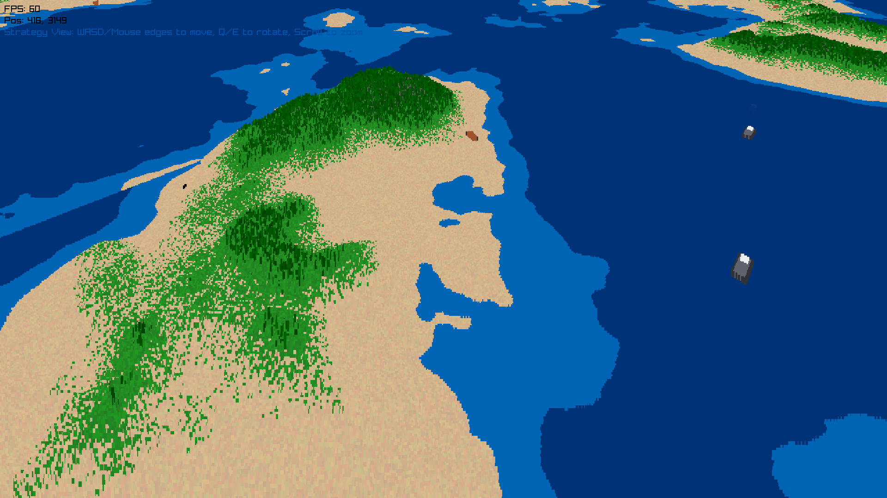

# Vortex Space Engine

A high-performance 3D terrain rendering engine built with RayLib in C.



## Download

Go to the [Relases](https://github.com/w84death/vortex-space-engine-raylib/releases) and download latest binary for Linux or .exe for Windows.

## Features

- Real-time 3D terrain rendering
- Optimized performance with modern C99
- Cross-platform support (Linux & Windows)
- Built on the powerful RayLib graphics library

## Building

### Quick Start
```bash
make          # Build for current system
make run      # Build and run
```

### Cross-Platform Builds
```bash
make linux    # Build optimized Linux binary
make windows  # Build Windows executable
make release  # Build both platforms
```

### Distribution Packages
```bash
make dist-linux     # Create Linux package
make dist-windows   # Create Windows package
```

## Requirements

- **gcc** (Linux builds)
- **mingw-w64** (Windows cross-compilation)  
- **upx** (executable compression)
- **wget, unzip, tar** (RayLib downloads)

### Install Dependencies

**Ubuntu/Debian:**
```bash
sudo apt-get install gcc mingw-w64 upx-ucl wget unzip
```

**Fedora:**
```bash
sudo dnf install gcc mingw64-gcc upx wget unzip
```

**Arch:**
```bash
sudo pacman -S gcc mingw-w64-gcc upx wget unzip
```

## Usage

Run the terrain renderer:
```bash
./terrain_renderer
```

## Help

```bash
make help     # Show all available targets
```

## License

MIT License - See source files for details.
